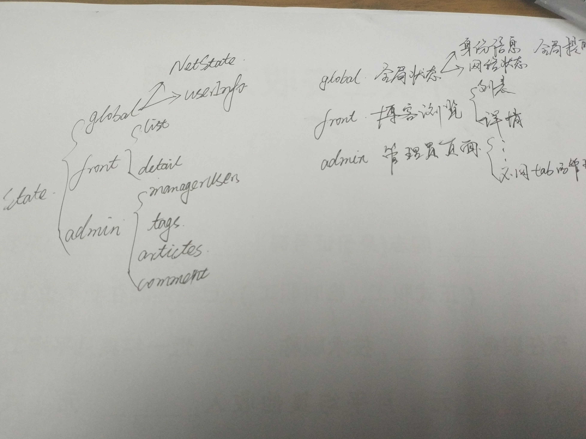
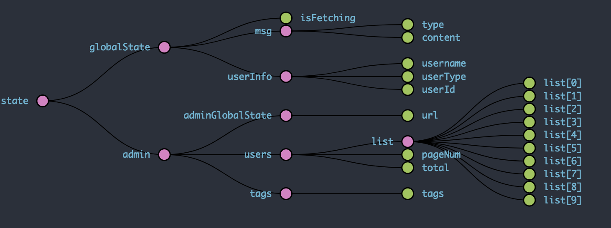

# 实战react技术栈+express前后端博客项目（1）-- 整体项目结构搭建

***[项目地址：](https://github.com/Nealyang/React-Express-Blog-Demo)https://github.com/Nealyang/React-Express-Blog-Demo***


> 本想等项目做完再连载一波系列博客，随着开发的进行，也是的确遇到了不少坑，请教了不少人。遂想，何不一边记录踩坑，一边分享收获呢。分享当然是好的，
如果能做到集思广益，那岂不是更美。我们的口号是：***坚决不会烂尾***

***本博客为连载代码博客同步更新博客，随着项目往后开发可能会遇到前面写的不合适的地方会再回头修改。如有不妥~欢迎兄弟们不啬赐教。谢谢！***

## 项目目录

项目目录大致如下：

```
.
├── README.md                   //项目说明文件
├── app                         //前端源码文件夹
│   ├── components              //前端组件文件夹
│   ├── configureStore.js       //配置store文件
│   ├── containers              //前端容器组件文件夹
│   ├── fetch                   //封装get/post请求文件夹
│   ├── index.js                //APP输出文件
│   ├── lib                     //存放第三方引入文件文件夹
│   ├── reducers                //reducer文件夹，包含actions、actionTypes
│   └── sagas                   //saga文件夹,异步action处理
├── config                      
│   └── config.js               //总应用配置文件
├── db                          //存放数据库的文件夹
├── modules                     //存放mongoose model文件夹
│   └── user.js                 //存放user model文件
├── package.json
├── postcss.config.js           //postcss配置文件
├── record                      //存放一些记录文件的文件夹
├── schemas                     //mongoose schema文件夹
│   └── users.js
├── server                      // server端源码文件夹
│   ├── api                     //server端 api接口文件夹
│   ├── index.js                //server启动文件
│   ├── server.js               //server文件
│   └── util.js                 //server端工具类文件
├── static                      //静态资源托管文件夹
│   └── favicon.ico
├── webpack.dev.js              //开发环境下webpack配置文件
└── webpack.prod.js             //生产环境下webpack配置文件
```

简单说下app里面react的项目结构。对于component，container这里不必多说了。saga用于对所有异步action的处理。
reducers里面存放了container对应所有的reducer、action、actionTypes。

比如：

    const initialState = {};
    
    export const actionTypes = {
        HOME_LOAD:'HOME_LOAD',
    };
    
    
    export function reducer(state=initialState,action) {
        switch (action.type){
            default:
                return state;
        }
    }
    
    export const action = {
      getArticleList:function () {
          return actionTypes.HOME_LOAD
      }
    };
    
对于这种写法，可以参照我上一篇[大众点评demo关于react项目结构的说明](https://github.com/Nealyang/React-Fullstack-Dianping-Demo/blob/master/docs/react%E6%8A%80%E6%9C%AF%E6%A0%88%E9%A1%B9%E7%9B%AE%E7%BB%93%E6%9E%84%E6%8E%A2%E7%A9%B6.md).

## state设计

曾经看过一篇文章，[如何合理的设计state](http://www.jianshu.com/p/085c426ee61e),看完以后的确受益匪浅。但是。。。。我擦，有必要这样子嘛~

所以，脑地瓜笨笨的我，这个demo，我还是打算粗略的设计下就好。



大致设计如下，然后目前(2017/09/28)已经完成部分 state 结构如下



这里兄弟们不要急，后面博客会写到如何构建的。

从这个state状态树中，我们也能够知道下一篇，我们要说的，前端react技术栈的等等配置。

## 项目实现步骤系列博客

- [x] [实战react技术栈+express前后端博客项目（0）-- 预热一波](./00_预热一波.md)
- [x] [实战react技术栈+express前后端博客项目（1）-- 整体项目结构搭建、state状态树设计](./01_整体项目结构搭建、state状态树设计.md)
- [ ] 实战react技术栈+express前后端博客项目（2）-- 前端react-xxx、路由配置
- [ ] 实战react技术栈+express前后端博客项目（3）-- 后端路由、代理以及静态资源托管等其他配置说明
- [ ] 实战react技术栈+express前后端博客项目（4）-- 博客首页代码编写以及redux-saga组织
- [ ] 实战react技术栈+express前后端博客项目（5）-- 前后端实现登录功能
- [ ] 实战react技术栈+express前后端博客项目（6）-- 使用session实现免登陆+管理后台权限验证
- [ ] 实战react技术栈+express前后端博客项目（7）-- 前端管理界面用户查看功能+后端对应接口开发
- [ ] 实战react技术栈+express前后端博客项目（8）-- 前端管理界面标签管理功能+后端对应接口开发
- [ ] 实战react技术栈+express前后端博客项目（9）-- 前端管理界面标签管理功能+后端对应接口开发
- [ ] 实战react技术栈+express前后端博客项目（10）-- 前端管理界面发表文章功能
- [ ] 实战react技术栈+express前后端博客项目（11）-- 后端接口对应文章部分的增删改查
- [ ] 实战react技术栈+express前后端博客项目（12）-- 前端对于发文部分的完善（增删改查、分页等）
- [ ] 实战react技术栈+express前后端博客项目（13）-- 前端对于发文部分的完善（增删改查等）
- [ ] 实战react技术栈+express前后端博客项目（14）-- 内容详情页以及阅读数的展示
- [ ] 实战react技术栈+express前后端博客项目（15）-- 博客添加评论功能以及对应后端实现
- [ ] 实战react技术栈+express前后端博客项目（16）-- pm2 的使用说明
- [ ] 实战react技术栈+express前后端博客项目（17）-- 收工

## 交流

倘若有哪里说的不是很明白，或者有什么需要与我交流，欢迎各位提issue。或者加群联系我~

***扫码关注我的个人微信公众号，直接回复，必有回应。分享更多原创文章。点击交流学习加我微信、qq群。一起学习，一起进步***


---

欢迎兄弟们加入：

Node.js技术交流群：209530601 

React技术栈：398240621

前端技术杂谈：604953717 (新建)

---

## more


