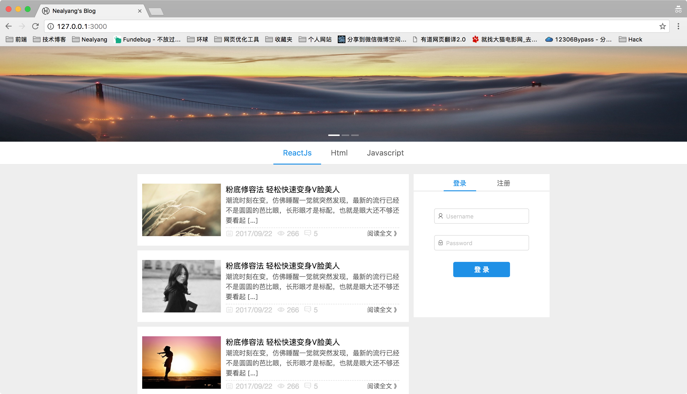
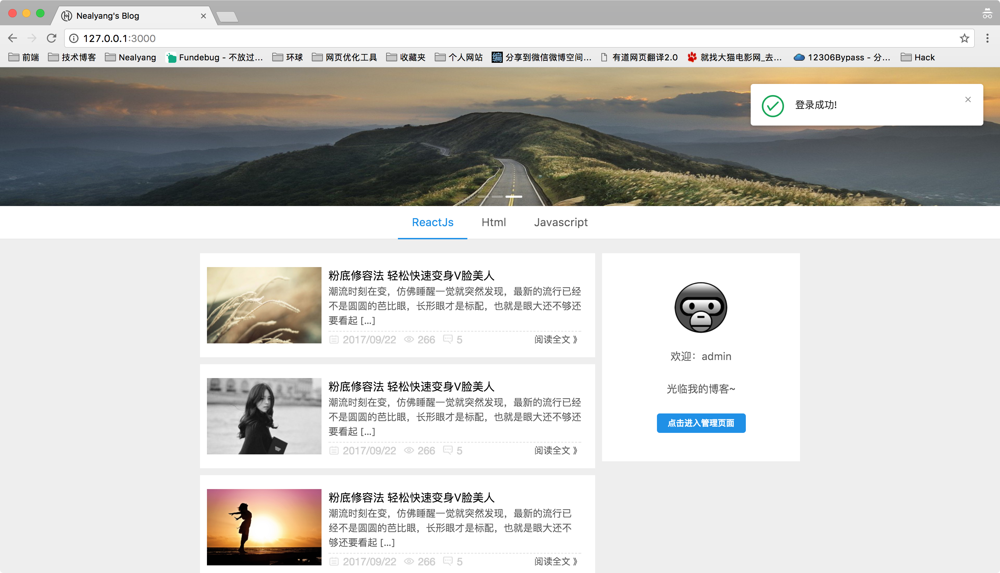

# 实战react技术栈+express前后端博客项目（4）-- 博客首页代码的编写以及redux-saga的组织

***[项目地址：](https://github.com/Nealyang/React-Express-Blog-Demo)https://github.com/Nealyang/React-Express-Blog-Demo***

> 本想等项目做完再连载一波系列博客，随着开发的进行，也是的确遇到了不少坑，请教了不少人。遂想，何不一边记录踩坑，一边分享收获呢。分享当然是好的，
如果能做到集思广益，那岂不是更美。我们的口号是：***坚决不会烂尾***

***本博客为连载代码博客同步更新博客，随着项目往后开发可能会遇到前面写的不合适的地方会再回头修改。如有不妥~欢迎兄弟们不啬赐教。谢谢！***

## 首页效果图(目前是假数据)

- 未登录

- 登录

## 首页部分代码编写

    class Home extends Component {
        constructor(props) {
            super(props);
            this.shouldComponentUpdate = PureRenderMixin.shouldComponentUpdate.bind(this)
        }
    
        render() {
            const {login,register} = this.props;
            localStorage.setItem('userInfo',JSON.stringify(this.props.userInfo));
            return (
                this.props.match.params.tag && (tags.indexOf(this.props.match.params.tag) === -1 || this.props.location.pathname.lastIndexOf('\/') > 0)
                    ?
                    <Redirect to='/404'/>
                    :
                    

                        

                            

                                <ArticleList/>
                                

                                    <Pagination defaultCurrent={6} total={500}/>
                                

                            

                            

                                {this.props.userInfo.userId?<Logined history={this.props.history} userInfo={this.props.userInfo}/>:<Login  login={login} register={register}/>}
                            

                        

                    

            )
        }
    }

因为将来我们会以标签来作为路由，展示不同标签页下的文章列表，所以当没有匹配到url没有匹配到对应标签的时候，我们显示404页面。

首页部分主要包括以下几项。轮播图（这里仅仅用作UI美观吧），标签，文章列表，分页，登录功能。

所以对于复杂编码的部分，我们单独抽出组件。而对于Home.js这个文件，也是点击所有标签对应的公共页面。只是文章列表不同而已。

## 登录注册form组件

别的组件都是常规编码，这里说下form组件吧

    class LoginFormCom extends Component {
        constructor(props) {
            super(props);
        }
    
        handleLogin = (e) => {
            e.preventDefault();
            this.props.form.validateFields((err, values) => {
                if (!err) {
                    this.props.login(values.userName,values.password)
                }
            });
        };
    
        render() {
            const {getFieldDecorator} = this.props.form;
            return (
                <Form onSubmit={this.handleLogin} className={style.formStyle}>
                    <FormItem>
                        {getFieldDecorator('userName', {
                            rules: [{required: true, message: '请输入用户名!'}],
                        })(
                            <Input prefix={<Icon type="user" style={{fontSize: 13}}/>} placeholder="Username"/>
                        )}
                    </FormItem>
                    <FormItem>
                        {getFieldDecorator('password', {
                            rules: [{required: true, message: '请输入密码!'}],
                        })(
                            <Input prefix={<Icon type="lock" style={{fontSize: 13}}/>} type="password"
                                   placeholder="Password"/>
                        )}
                    </FormItem>
                    <FormItem>
                        <Button className={style.loginButton} type="primary" htmlType="submit">
                            登录
                        </Button>
                    </FormItem>
                </Form>
            )
        }
    }
    
    const LoginForm = Form.create()(LoginFormCom);
    
    export default LoginForm
    
这里我是将登录和注册单独拿出来写了两个组件的。具体写法可以参考antd官方文档。

## saga部分

***这部分说的saga仅仅是一些全局信息的saga，包含错误信息提醒、全局的Loading、登录状态等。并非首页文章列表标签的saga***

### reducer

    const initialState = {
        isFetching: true,
        msg: {
            type: 1,//0失败 1成功
            content: ''
        },
        userInfo: {}
    };
    
    export const actionsTypes = {
        FETCH_START: "FETCH_START",
        FETCH_END: "FETCH_END",
        USER_LOGIN: "USER_LOGIN",
        USER_REGISTER: "USER_REGISTER",
        RESPONSE_USER_INFO: "RESPONSE_USER_INFO",
        SET_MESSAGE: "SET_MESSAGE",
        USER_AUTH:"USER_AUTH"
    };
    
    export const actions = {
        get_login: function (username, password) {
            return {
                type: actionsTypes.USER_LOGIN,
                username,
                password
            }
        },
        get_register: function (data) {
            return {
                type: actionsTypes.USER_REGISTER,
                data
            }
        },
        clear_msg: function () {
            return {
                type: actionsTypes.SET_MESSAGE,
                msgType: 1,
                msgContent: ''
            }
        },
        user_auth:function () {
            return{
                type:actionsTypes.USER_AUTH
            }
        }
    };
    
    export function reducer(state = initialState, action) {
        switch (action.type) {
            case actionsTypes.FETCH_START:
                return {
                    ...state, isFetching: true
                };
            case actionsTypes.FETCH_END:
                return {
                    ...state, isFetching: false
                };
            case actionsTypes.SET_MESSAGE:
                return {
                    ...state,
                    isFetching: false,
                    msg: {
                        type: action.msgType,
                        content: action.msgContent
                    }
                };
            case actionsTypes.RESPONSE_USER_INFO:
                return {
                    ...state, userInfo: action.data
                };
            default:
                return state
        }
    }
    
    // const front = combineReducers({
    //    // home
    // });
    
    export default combineReducers({
        // front,
        globalState: reducer,
        admin
    })
    
说下几个状态。

        FETCH_START: "开始进行异步请求",
        FETCH_END: "异步请求结束",
        USER_LOGIN: "用户登录",
        USER_REGISTER: "用户注册",
        RESPONSE_USER_INFO: "收到登录信息",
        SET_MESSAGE: "设置全局提醒",
        USER_AUTH:"USER_AUTH"//后面免登陆再说这个
        
对应中saga的处理

    export function* login(username, password) {
        yield put({type: IndexActionTypes.FETCH_START});
        try {
            return yield call(post, '/user/login', {username, password})
        } catch (error) {
            yield put({type:IndexActionTypes.SET_MESSAGE,msgContent:'用户名或密码错误',msgType:0});
        } finally {
            yield put({type: IndexActionTypes.FETCH_END});
        }
    }
    
    export function* register (data) {
        yield put({type:IndexActionTypes.FETCH_START});
        try {
            return yield call(post, '/user/register', data)
        } catch (error) {
            yield put({type:IndexActionTypes.SET_MESSAGE,msgContent:'注册失败',msgType:0});
        } finally {
            yield put({type: IndexActionTypes.FETCH_END});
        }
    }
    
    export function* loginFlow() {
        while (true) {
            let request = yield take(IndexActionTypes.USER_LOGIN);
            let response = yield call(login, request.username, request.password);
            if(response&&response.code === 0){
                yield put({type:IndexActionTypes.SET_MESSAGE,msgContent:'登录成功!',msgType:1});
                yield put({type:IndexActionTypes.RESPONSE_USER_INFO,data:response.data})
            }
        }
    }
    
    export function* registerFlow () {
        while(true){
            let request = yield take(IndexActionTypes.USER_REGISTER);
            let response = yield call(register, request.data);
            if(response&&response.code === 0){
                yield put({type:IndexActionTypes.SET_MESSAGE,msgContent:'注册成功!',msgType:1});
                yield put({type:IndexActionTypes.RESPONSE_USER_INFO,data:response.data})
            }
    
        }
    }
    
    export function* user_auth () {
        while(true){
            yield take(IndexActionTypes.USER_AUTH);
            try {
                yield put({type:IndexActionTypes.FETCH_START});
                let response = yield call(get,'/user/userInfo');
                if(response && response.code === 0){
                    yield put({type:IndexActionTypes.RESPONSE_USER_INFO,data:response.data})
                }
            }catch (err){
                console.log(err);
            }finally {
                yield put({type: IndexActionTypes.FETCH_END});
            }
        }
    }
    
 saga中主要是对用户登录和注册的处理。每一个saga处理函数中都需要put一个请求开始和请求结束的action，如果请求错误，则需要设置全局状态提醒。
 
 user_auth是后面免登陆的一个saga处理，后续介绍，这里大家可以略过。
 
 
## 总结

如上，在登录的时候，我们dispatch一个login的action，saga则会捕捉该action，然后对应处理后，put相应的action给reducer。

具体的操作，大家可以自行github上查看代码

---

该部分主要是前端操作，所以代码部分都是在 /app 文件夹下。

---

## 项目实现步骤系列博客

- [x] [实战react技术栈+express前后端博客项目（0）-- 预热一波](./00_预热一波.md)
- [x] [实战react技术栈+express前后端博客项目（1）-- 整体项目结构搭建、state状态树设计](./01_整体项目结构搭建、state状态树设计.md)
- [x] [实战react技术栈+express前后端博客项目（2）-- 前端react-xxx、路由配置](./02_前端react-xxx、路由配置.md)
- [x] [实战react技术栈+express前后端博客项目（3）-- 后端路由、代理以及静态资源托管等其他配置说明](./03_后端路由、代理以及静态资源托管等其他配置说明.md)
- [x] [实战react技术栈+express前后端博客项目（4）-- 博客首页代码编写以及redux-saga组织](./04_博客首页代码编写以及redux-saga组织.md)
- [ ] 实战react技术栈+express前后端博客项目（5）-- 前后端实现登录功能
- [ ] 实战react技术栈+express前后端博客项目（6）-- 使用session实现免登陆+管理后台权限验证
- [ ] 实战react技术栈+express前后端博客项目（7）-- 前端管理界面用户查看功能+后端对应接口开发
- [ ] 实战react技术栈+express前后端博客项目（8）-- 前端管理界面标签管理功能+后端对应接口开发
- [ ] 实战react技术栈+express前后端博客项目（9）-- 前端管理界面评论管理功能+后端对应接口开发
- [ ] 实战react技术栈+express前后端博客项目（10）-- 前端管理界面发表文章功能
- [ ] 实战react技术栈+express前后端博客项目（11）-- 后端接口对应文章部分的增删改查
- [ ] 实战react技术栈+express前后端博客项目（12）-- 前端对于发文部分的完善（增删改查、分页等）
- [ ] 实战react技术栈+express前后端博客项目（13）-- 前端对于发文部分的完善（增删改查等）
- [ ] 实战react技术栈+express前后端博客项目（14）-- 内容详情页以及阅读数的展示
- [ ] 实战react技术栈+express前后端博客项目（15）-- 博客添加评论功能以及对应后端实现
- [ ] 实战react技术栈+express前后端博客项目（16）-- pm2 的使用说明
- [ ] 实战react技术栈+express前后端博客项目（17）-- 收工

## 交流

倘若有哪里说的不是很明白，或者有什么需要与我交流，欢迎各位提issue。或者加群联系我~

***扫码关注我的个人微信公众号，直接回复，必有回应。分享更多原创文章。点击交流学习加我微信、qq群。一起学习，一起进步***

---

欢迎兄弟们加入：

Node.js技术交流群：209530601 

React技术栈：398240621

前端技术杂谈：604953717 (新建)

---