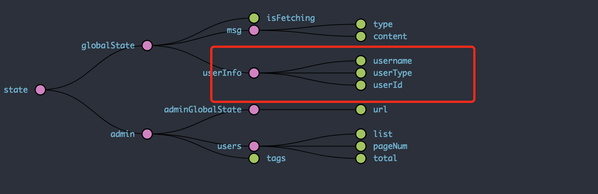

# 实战react技术栈+express前后端博客项目（6）-- 使用session实现免登陆+管理后台权限验证

***[项目地址：](https://github.com/Nealyang/React-Express-Blog-Demo)https://github.com/Nealyang/React-Express-Blog-Demo***


> 本想等项目做完再连载一波系列博客，随着开发的进行，也是的确遇到了不少坑，请教了不少人。遂想，何不一边记录踩坑，一边分享收获呢。分享当然是好的，
如果能做到集思广益，那岂不是更美。我们的口号是：***坚决不会烂尾***

***本博客为连载代码博客同步更新博客，随着项目往后开发可能会遇到前面写的不合适的地方会再回头修改。如有不妥~欢迎兄弟们不啬赐教。谢谢！***

## session

### 后端部分

上一篇文章中，我们已经实现了前后端的登录功能。问题大家可能都已经发现了，当刷新页面的时候，之前登录过的现在得重新登录。显然，这个并不是我们想想要的。

所以这里我们采用session的机制来解决这类问题。不了session和coolie可以参考我[这篇博客](https://my.oschina.net/Nealyang/blog/844049)。

apiServer.js

    app.use(cookieParser('express_react_cookie'));
    app.use(session({
        secret:'express_react_cookie',
        resave: true,
        saveUninitialized:true,
        cookie: {maxAge: 60 * 1000 * 30}//过期时间
    }));
    
因为是登录信息，所以这里我们采用的是session。首先需要在apiServer.js中引入cookie-parser和express-session中间件。

coolieParser里面设置一个key，必须要和session中一致。然后设置coolie的过期时间。这里我们设置为30min。

然后再用户登录成功了以后，我们需要设置session

    router.post('/login', (req, res) => {
        let {username, password} = req.body;
        if (!username) {
            responseClient(res, 400, 2, '用户名不可为空');
            return;
        }
        if (!password) {
            responseClient(res, 400, 2, '密码不可为空');
            return;
        }
        User.findOne({
            username,
            password: md5(password + MD5_SUFFIX)
        }).then(userInfo => {
            if (userInfo) {
                //登录成功
                let data = {};
                data.username = userInfo.username;
                data.userType = userInfo.type;
                data.userId = userInfo._id;
                //登录成功后设置session
                req.session.userInfo = data;
    
                responseClient(res, 200, 0, '登录成功', data);
                return;
            }
            responseClient(res, 400, 1, '用户名密码错误');
    
        }).catch(err => {
            responseClient(res);
        })
    });
    
其中，
```req.session.userInfo = data```即为设置session的userInfo。

然后再server端需要另写一个接口。在用户打开网站的时候就发起请求，验证用户是否已经登录。

    //用户验证
    router.get('/userInfo',function (req,res) {
        if(req.session.userInfo){
            responseClient(res,200,0,'',req.session.userInfo)
        }else{
            responseClient(res,200,1,'请重新登录',req.session.userInfo)
        }
    });
    
很简单，就是将请求中的req.session.userInfo的信息返回过去。这样，当用户访问网站的时候，先发送这个请求，来判断用户知否已经登陆过。如果已经登陆过，拿到这个userInfo直接put一个action到reducer中，修改state状态树即可。

### 前端部分

前端部分比较常规。在最外层的container中，直接发送请求即可

    class AppIndex extends Component {
    
        constructor(props) {
            super(props);
            this.openNotification = this.openNotification.bind(this);
            this.shouldComponentUpdate = PureRenderMixiin.shouldComponentUpdate.bind(this);
        }
    
        openNotification(type, message) {
            let that = this;
            notification[type]({
                message: message,
                onClose: () => {
                    that.props.clear_msg();
                }
            });
            that.props.clear_msg();
        };
    
        render() {
            let {isFetching} = this.props;
            return (
                <Router>
                    <div>
                        <Switch>
                            <Route path='/404' component={NotFound}/>
                            <Route path='/admin' component={Admin}/>
                            <Route component={Front}/>
                        </Switch>
                        {isFetching && <Loading/>}
                        {this.props.notification && this.props.notification.content ?
                            (this.props.notification.type === 1 ?
                                this.openNotification('success', this.props.notification.content) :
                                this.openNotification('error', this.props.notification.content)) :
                            null}
                    </div>
                </Router>
            )
        }
    
        componentDidMount() {
            this.props.user_auth();
        }
    
    }

然后对应saga的处理也比较常规，这里不再赘述。

## 权限认证

因为是博客系统，所以所谓的权限就是判断改登录用户是否为管理员。我们在设计user表的时候，添加了身份一项。当然，咱可以随意用别的字符来标识管理员和普通用户。

     render() {
            const {url} = this.props.match;
            if(this.props.userInfo.userType){
                return (
                    <div>
                        {
                            this.props.userInfo.userType === 'admin' ?
                                <div className={style.container}>
                                    <div className={style.menuContainer}>
                                        <AdminMenu history={this.props.history}
                                                   url={this.props.adminUrl}
                                                   changeUrl={this.props.change_location_admin}/>
                                    </div>
                                    <div className={style.contentContainer}>
                                        <Switch>
                                            <Route exact path={url} component={AdminIndex}/>
                                            <Route path={`${url}/managerUser`} component={AdminManagerUser}/>
                                            <Route path={`${url}/managerTags`} component={AdminManagerTags}/>
                                            <Route path={`${url}/newArticle`} component={AdminNewArticle}/>
                                            <Route path={`${url}/detail`} component={Detail}/>
                                            <Route component={NotFound}/>
                                        </Switch>
                                    </div>
                                </div> :
                                <Redirect to='/'/>
                        }
                    </div>
                )
            }else{
                return <NotFound/>
            }
        }

在admin.js中，我们判断state中是否有userInfo这个选项。

如果userInfo是有值的，那么说明已经登录。如果没有值，则跳转到NotFound页面。

为什么先显示notFound界面，而不是在userInfo为空的时候直接Redirect？

***这里有个大坑，具体看我segmentFault上的提问：[react redux身份验证，取state的问题](https://segmentfault.com/q/1010000011325608)***

以上即为admin的权限认证，如上，当admin登录到管理后天的时候，既可以到管理界面，当不是admin登录到管理后台的时候，会直接Redirect到博客首页。

## 总结

如上，我们就直线了用户的免登陆以及权限管理的问题。主要就是通过session和状态树的判断。
下一篇，我们就开始后端部分的开发~

 ## 项目实现步骤系列博客
 
 - [x] [实战react技术栈+express前后端博客项目（0）-- 预热一波](./00_预热一波.md)
 - [x] [实战react技术栈+express前后端博客项目（1）-- 整体项目结构搭建、state状态树设计](./01_整体项目结构搭建、state状态树设计.md)
 - [x] [实战react技术栈+express前后端博客项目（2）-- 前端react-xxx、路由配置](./02_前端react-xxx、路由配置.md)
 - [x] [实战react技术栈+express前后端博客项目（3）-- 后端路由、代理以及静态资源托管等其他配置说明](./03_后端路由、代理以及静态资源托管等其他配置说明.md)
 - [x] [实战react技术栈+express前后端博客项目（4）-- 博客首页代码编写以及redux-saga组织](./04_博客首页代码编写以及redux-saga组织.md)
 - [x] [实战react技术栈+express前后端博客项目（5）-- 前后端实现登录功能](./05_前后端实现登录功能.md)
 - [x] [实战react技术栈+express前后端博客项目（6）-- 使用session实现免登陆+管理后台权限验证](./06_使用session实现免登陆+管理后台权限验证.md)
 - [ ] 实战react技术栈+express前后端博客项目（7）-- 前端管理界面用户查看功能+后端对应接口开发
 - [ ] 实战react技术栈+express前后端博客项目（8）-- 前端管理界面标签管理功能+后端对应接口开发
 - [ ] 实战react技术栈+express前后端博客项目（9）-- 前端管理界面评论管理功能+后端对应接口开发
 - [ ] 实战react技术栈+express前后端博客项目（10）-- 前端管理界面发表文章功能
 - [ ] 实战react技术栈+express前后端博客项目（11）-- 后端接口对应文章部分的增删改查
 - [ ] 实战react技术栈+express前后端博客项目（12）-- 前端对于发文部分的完善（增删改查、分页等）
 - [ ] 实战react技术栈+express前后端博客项目（13）-- 前端对于发文部分的完善（增删改查等）
 - [ ] 实战react技术栈+express前后端博客项目（14）-- 内容详情页以及阅读数的展示
 - [ ] 实战react技术栈+express前后端博客项目（15）-- 博客添加评论功能以及对应后端实现
 - [ ] 实战react技术栈+express前后端博客项目（16）-- pm2 的使用说明
 - [ ] 实战react技术栈+express前后端博客项目（17）-- 收工
 
 ## 交流
 
 倘若有哪里说的不是很明白，或者有什么需要与我交流，欢迎各位提issue。或者加群联系我~
 
 ***扫码关注我的个人微信公众号，直接回复，必有回应。分享更多原创文章。点击交流学习加我微信、qq群。一起学习，一起进步***
 
 
 
 ---
 
 欢迎兄弟们加入：
 
 Node.js技术交流群：209530601 
 
 React技术栈：398240621
 
 前端技术杂谈：604953717 (新建)
 
 ---