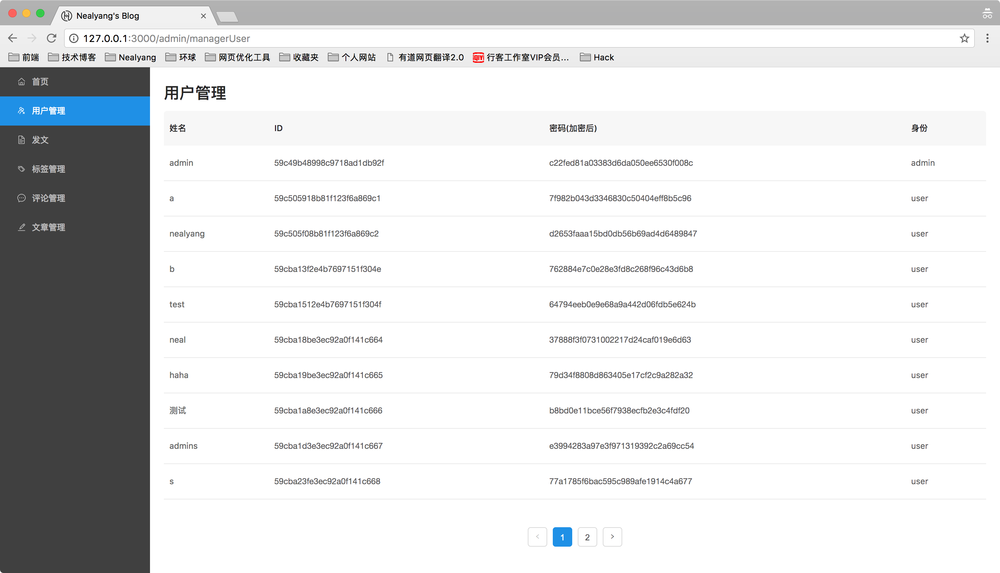

#  实战react技术栈+express前后端博客项目（7）-- 前端管理界面用户查看功能+后端对应接口开发

***[项目地址：](https://github.com/Nealyang/React-Express-Blog-Demo)https://github.com/Nealyang/React-Express-Blog-Demo***

> 本想等项目做完再连载一波系列博客，随着开发的进行，也是的确遇到了不少坑，请教了不少人。遂想，何不一边记录踩坑，一边分享收获呢。分享当然是好的，
如果能做到集思广益，那岂不是更美。我们的口号是：***坚决不会烂尾***

***本博客为连载代码博客同步更新博客，随着项目往后开发可能会遇到前面写的不合适的地方会再回头修改。如有不妥~欢迎兄弟们不啬赐教。谢谢！***

## 前端管理界面用户信息查看

### 界面展示

### 前端部分编码

adminManagerUser.js

    const initialState = {
        list: [],
        pageNum: 1,
        total:0
    };
    export const actionTypes = {
        'GET_ALL_USER': "GET_ALL_USER",
        'RESOLVE_GET_ALL_USERS': "RESOLVE_GET_ALL_USERS"
    };
    
    export const actions = {
        get_all_users: function (pageNum=1) {
            return {
                type: actionTypes.GET_ALL_USER,
                pageNum:pageNum
            }
        }
    };
    
    export function users(state = initialState, action) {
        switch (action.type) {
            case actionTypes.RESOLVE_GET_ALL_USERS:
                return {
                    list: action.data.list,
                    pageNum: action.data.pageNum,
                    total:action.data.total
                };
            default:
                return state;
    
        }
    }
   
常规操作，这里之所以保存了pageNum状态树以及list信息，是为了防止每次进入页面都需要重新获取下数据。做一个缓存的优化。

界面编码部分比较简单，其实就是一个表格，以为布局我觉得比较烦，所以直接在底下加了一个分页。

代码如下：

    render() {
            return (
                

                    <h2>用户管理</h2>
                    <Table
                        className={style.table}
                        pagination={false}
                        columns={columns}
                        dataSource={this.props.list}/>
                    

                        <Pagination
                            onChange={(pageNum)=>{
                                this.props.getAllUsers(pageNum);
                            }}
                            current={this.props.pageNum}
                            total={this.props.total}/>
                    

                

    
            )
        }
        
        ...
        ...
        
        AdminManagerUser.propsTypes = {
            pageNUm: PropTypes.number.isRequired,
            list: PropTypes.arrayOf(PropTypes.object),
            total:PropTypes.number.isRequired
        };
        
        AdminManagerUser.defaultProps = {
            pageNum: 1,
            list: [],
            total:0
        };
        
        function mapStateToProps(state) {
            let {pageNum, list,total} = state.admin.users;
            return {
                pageNum,
                list,
                total
            }
        }
        
        function mapDispatchToProps(dispatch) {
            return {
                getAllUsers: bindActionCreators(get_all_users, dispatch)
            }
        }
        
        export default connect(
            mapStateToProps,
            mapDispatchToProps
        )(AdminManagerUser)

在进入页面的时候，需要发起请求，再次切入回来，查看list是否为空，否则才发起数据请求。对应saga处理：

    export function* fetch_users(pageNum) {
        yield put({type: IndexActionTypes.FETCH_START});
        try {
            return yield call(get, `/admin/getUsers?pageNum=${pageNum}`);
        } catch (err) {
            yield put({type: IndexActionTypes.SET_MESSAGE, msgContent: '网络请求错误', msgType: 0});
        } finally {
            yield put({type: IndexActionTypes.FETCH_END})
        }
    }
    
    export function* get_all_users_flow() {
        while (true) {
            let request = yield take(ManagerUserActionTypes.GET_ALL_USER);
            let pageNum = request.pageNum||1;
            let response = yield call(fetch_users,pageNum);
            if(response&&response.code === 0){
                for(let i = 0;i<response.data.list.length;i++){
                    response.data.list[i].key = i;
                }
                let data = {};
                data.total = response.data.total;
                data.list  = response.data.list;
                data.pageNum = Number.parseInt(pageNum);
                yield put({type:ManagerUserActionTypes.RESOLVE_GET_ALL_USERS,data:data})
            }else{
                yield put({type:IndexActionTypes.SET_MESSAGE,msgContent:response.message,msgType:0});
            }
        }
    }
    
 saga中需要注意的就是pageNum的处理。以及在每次发起请求的时候都要先发起FETCH_START的action。
 
 ## 后端部分
 
 后端部分的编码比较简单，其实及时一个分页的操作。
 
     router.get('/getUsers',(req,res)=>{
         let skip =(req.query.pageNum-1)<0?0:(req.query.pageNum-1)*10;
         let responseData = {
             total:0,
             list:[]
         };
         User.count()
             .then(count=>{
                 responseData.total = count;
                 User.find(null,'_id username type password',{skip:skip,limit:10})
                     .then((result)=>{
                     responseData.list = result;
                         responseClient(res,200,0,'',responseData)
                     })
                     .catch(err=>{
                         responseClient(res);
                     })
             });
     });
     
因为感觉用户注册了随意删除啥的不太好，所以这里就只做了查看的功能。就当做单独演示分页的操作吧。limit为每页的数量。skip为跳过的数据。

## 结束语

基本也就是一个前后端简单的交互工作。后端写好接口。前端对应异步action发出。然后saga对接受到的数据进行处理返回给reducer处理最后组织出来state树。

虽然只有一个查的操作。但是也展现了基本的交互。下一篇博客将介绍标签的管理。涉及数据的增删改查等。

## 项目实现步骤系列博客
 
 - [x] [实战react技术栈+express前后端博客项目（0）-- 预热一波](./00_预热一波.md)
 - [x] [实战react技术栈+express前后端博客项目（1）-- 整体项目结构搭建、state状态树设计](./01_整体项目结构搭建、state状态树设计.md)
 - [x] [实战react技术栈+express前后端博客项目（2）-- 前端react-xxx、路由配置](./02_前端react-xxx、路由配置.md)
 - [x] [实战react技术栈+express前后端博客项目（3）-- 后端路由、代理以及静态资源托管等其他配置说明](./03_后端路由、代理以及静态资源托管等其他配置说明.md)
 - [x] [实战react技术栈+express前后端博客项目（4）-- 博客首页代码编写以及redux-saga组织](./04_博客首页代码编写以及redux-saga组织.md)
 - [x] [实战react技术栈+express前后端博客项目（5）-- 前后端实现登录功能](./05_前后端实现登录功能.md)
 - [x] [实战react技术栈+express前后端博客项目（6）-- 使用session实现免登陆+管理后台权限验证](./06_使用session实现免登陆+管理后台权限验证.md)
 - [x] [实战react技术栈+express前后端博客项目（7）-- 前端管理界面用户查看功能+后端对应接口开发](./07_前端管理界面用户查看功能+后端对应接口开发.md)
 - [ ] 实战react技术栈+express前后端博客项目（8）-- 前端管理界面标签管理功能+后端对应接口开发
 - [ ] 实战react技术栈+express前后端博客项目（9）-- 前端管理界面评论管理功能+后端对应接口开发
 - [ ] 实战react技术栈+express前后端博客项目（10）-- 前端管理界面发表文章功能
 - [ ] 实战react技术栈+express前后端博客项目（11）-- 后端接口对应文章部分的增删改查
 - [ ] 实战react技术栈+express前后端博客项目（12）-- 前端对于发文部分的完善（增删改查、分页等）
 - [ ] 实战react技术栈+express前后端博客项目（13）-- 前端对于发文部分的完善（增删改查等）
 - [ ] 实战react技术栈+express前后端博客项目（14）-- 内容详情页以及阅读数的展示
 - [ ] 实战react技术栈+express前后端博客项目（15）-- 博客添加评论功能以及对应后端实现
 - [ ] 实战react技术栈+express前后端博客项目（16）-- pm2 的使用说明
 - [ ] 实战react技术栈+express前后端博客项目（17）-- 收工
 
 ## 交流
 
 倘若有哪里说的不是很明白，或者有什么需要与我交流，欢迎各位提issue。或者加群联系我~
 
 ***扫码关注我的个人微信公众号，直接回复，必有回应。分享更多原创文章。点击交流学习加我微信、qq群。一起学习，一起进步***
 
 
 
 ---
 
 欢迎兄弟们加入：
 
 Node.js技术交流群：209530601 
 
 React技术栈：398240621
 
 前端技术杂谈：604953717 (新建)
 
 ---
