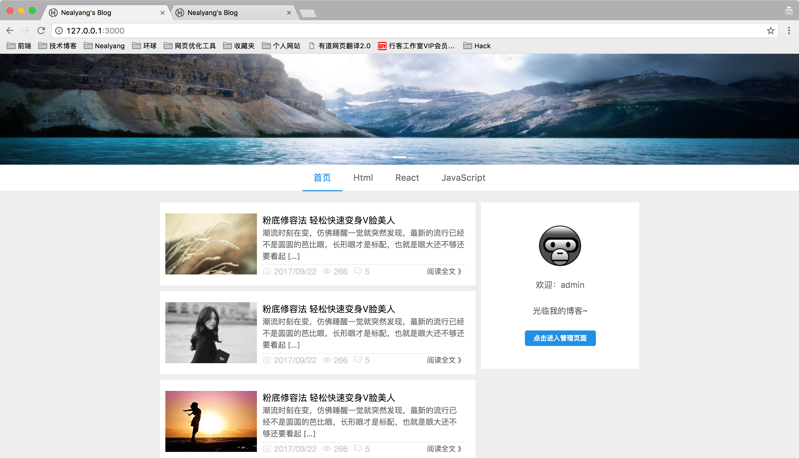
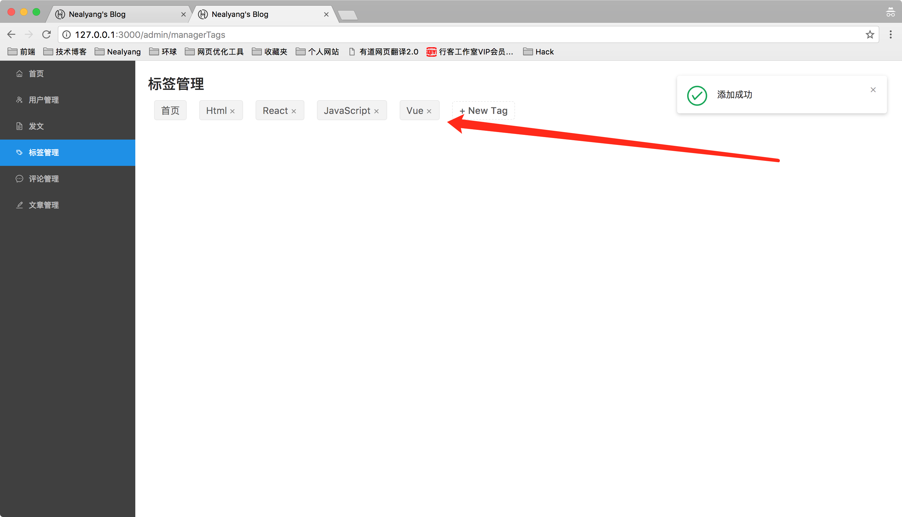
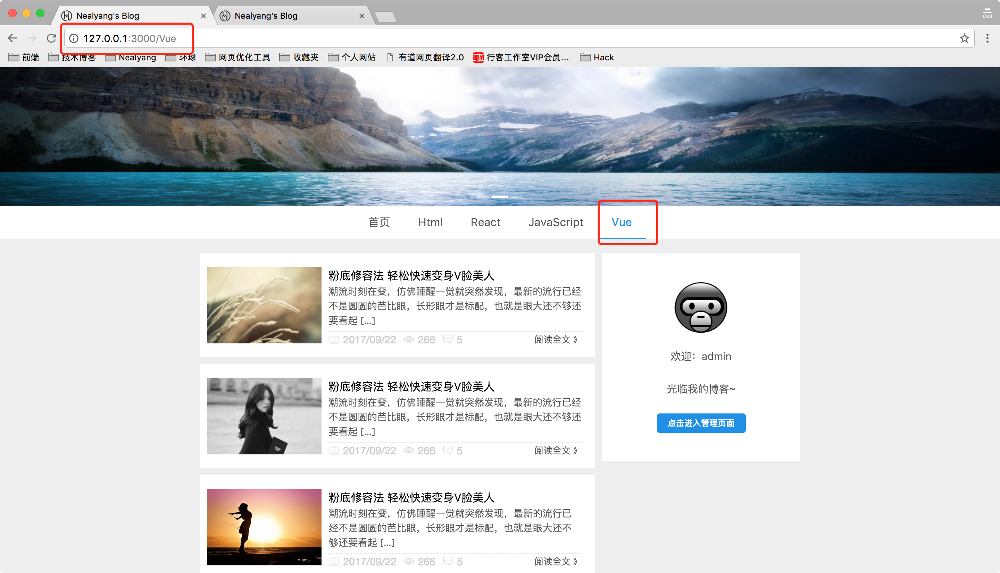
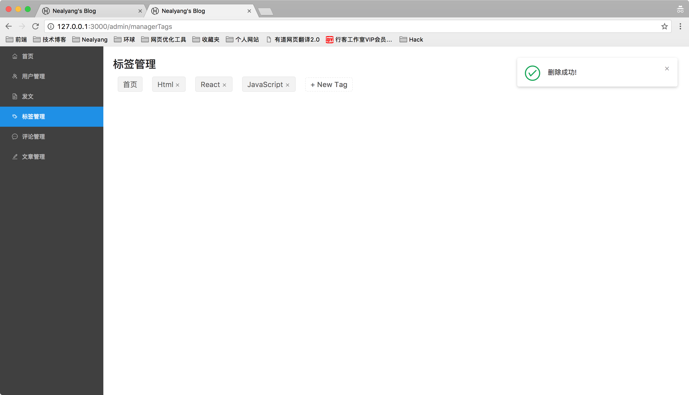
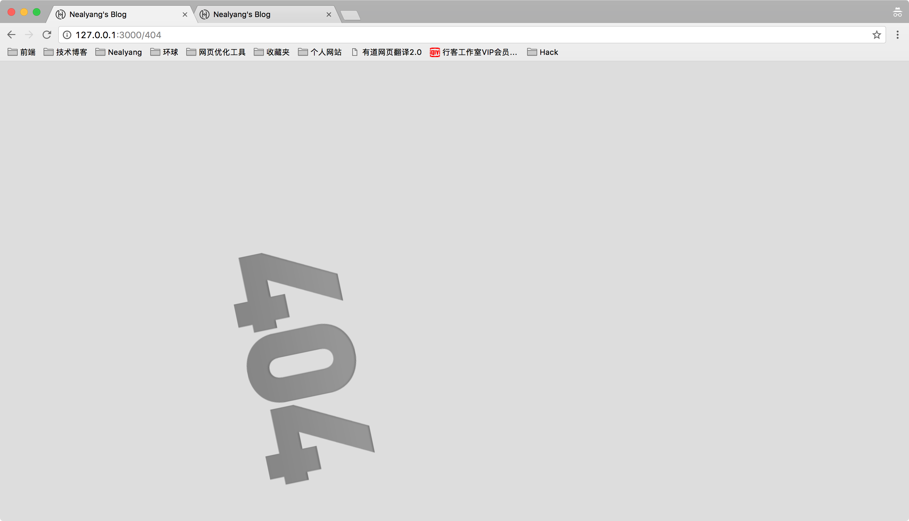

#  实战react技术栈+express前后端博客项目（8）-- 前端管理界面标签管理+后端对应接口开发

***[项目地址：](https://github.com/Nealyang/React-Express-Blog-Demo)https://github.com/Nealyang/React-Express-Blog-Demo***

> 本想等项目做完再连载一波系列博客，随着开发的进行，也是的确遇到了不少坑，请教了不少人。遂想，何不一边记录踩坑，一边分享收获呢。分享当然是好的，
如果能做到集思广益，那岂不是更美。我们的口号是：***坚决不会烂尾***

***本博客为连载代码博客同步更新博客，随着项目往后开发可能会遇到前面写的不合适的地方会再回头修改。如有不妥~欢迎兄弟们不啬赐教。谢谢！***

## 前面内容修改部分

由于该博客内容是开发和发文同步连载，所以在随着开发的进行，会修改之前的开发代码。

### 权限认证

对于权限认证之前我们只做了一部分权限管理，在前端页面发生跳转的时候，我们通过检测state的userInfo来确定当前登录用户是否有权访问。

但是，这里存在一个隐患，就是我登录到一个管理界面以管理员身份，但是知道我身份过期之前都没进行操作和跳转，一直在后端管理界面。然后当我身份过期以后，我进行了admin的一些管理操作（增删改查），且不涉及到页面的跳转。前端没法通过url来判断。

所以，这里我们修改了前后端内容，拦截所有的/admin的api操作，来判断身份是否过期。

admin.js

    //admin请求后台验证
    
    router.use( (req,res,next) =>{
        if(req.session.userInfo){
            next()
        }else{
            res.send(responseClient(res,200,1,'身份信息已过期，请重新登录'));
        }
    });
    
在前端saga里我们需要判断接口返回的信息。

    export function* delTagFlow() {
             while (true){
                 let req = yield take(ManagerTagsTypes.DELETE_TAG);
                 let res = yield call(delTag,req.name);
                 if (res.code === 0) {
                     yield put({type: IndexActionTypes.SET_MESSAGE, msgContent: res.message, msgType: 1});
                     yield put({type:ManagerTagsTypes.GET_ALL_TAGS});
                 } else if (res.message === '身份信息已过期，请重新登录') {
                     yield put({type: IndexActionTypes.SET_MESSAGE, msgContent: res.message, msgType: 0});
                     setTimeout(function () {
                         location.replace('/');
                     }, 1000);
                 } else {
                     yield put({type: IndexActionTypes.SET_MESSAGE, msgContent: res.message, msgType: 0});
                 }
             }
         }
         
***目前我没有想到可以一劳永逸不要每个saga都做处理的方法，如果兄弟们有好的想法，望不啬赐教，提issue，我们一起讨论***

### 前端路由抽出组件

之前我们在前端页面中，front组件直接写的一个函数，后来发现不是很合理，因为front我需要将他变为容器组件。所以这里我们需要把它抽出来一个class作为container
    
    const {get_all_tags} = actions;
    
    class Front extends Component{
        constructor(props){
            super(props);
        }
    
        render(){
            const {url} = this.props.match;
            return(
                

                    

                        <Banner/>
                        <Menus categories={this.props.categories} history={this.props.history}/>
                    

                    <Switch>
                        <Route exact path={url} component={Home}/>
                        <Route path={`/detail/:id`} component={Detail}/>
                        <Route path={`/:tag`} component={Home}/>
                        <Route component={NotFound}/>
                    </Switch>
                

            )
        }
    
        componentDidMount() {
            this.props.get_all_tags();
        }
    }
    
    Front.defaultProps = {
        categories:[]
    };
    
    Front.propTypes = {
        categories:PropTypes.array.isRequired
    };
    
    function mapStateToProps(state) {
        return{
            categories:state.admin.tags
        }
    }
    function mapDispatchToProps(dispatch) {
        return{
            get_all_tags:bindActionCreators(get_all_tags,dispatch)
        }
    }
    export default connect(
        mapStateToProps,
        mapDispatchToProps
    )(Front)
    
### Home.js 路由判断重定向

    return (
                tags.length>1&&this.props.match.params.tag && (tags.indexOf(this.props.match.params.tag) === -1 || this.props.location.pathname.lastIndexOf('\/') > 0)
                    ?
                    <Redirect to='/404'/>
                    :
                    

                        

                            

                                <ArticleList/>
                                

                                    <Pagination defaultCurrent={6} total={500}/>
                                

                            

                            

                                {this.props.userInfo.userId?<Logined history={this.props.history} userInfo={this.props.userInfo}/>:<Login  login={login} register={register}/>}
                            

                        

                    

            )
  
这里我们需要判断tags的长度，因为现在tags是异步获取的。所以存在时差。比如命名可以访问/Html标签，但是由于是异步获取的tags，当在当前页面刷新的时候，tags并没有加载完全，所以会直接重定向到404页面。

## 标签管理运行效果展示

因为gif是在太大了所以这里就放两张图片，大家略微感受下。

- 初始状态

- 添加tag

- 前端标签变化

- 删除tag

- 回到初始状态，/Vue刷新会Redirect到404

## 后端代码部分

    //删除标签
    router.get('/delTag', function (req, res) {
        let {name} = req.query;
        Tags.remove({name})
            .then(result => {
                if(result.result.n === 1){
                    responseClient(res,200,0,'删除成功!')
                }else{
                    responseClient(res,200,1,'标签不存在');
                }
            }).catch(err => {
            responseClient(res);
        });
    });
    
    //添加标签
    router.post('/addTag', function (req, res) {
        let {name} = req.body;
        Tags.findOne({
            name
        }).then(result => {
            if (!result) {
                let tag = new Tags({
                    name
                });
                tag.save()
                    .then(data => {
                        responseClient(res, 200, 0, '添加成功', data);
                    }).catch(err => {
                    throw err
                })
            } else {
                responseClient(res, 200, 1, '该标签已存在');
            }
        }).catch(err => {
            responseClient(res);
        });
    });
    
    
    module.exports = router;
    
为了代码清晰，方便管理，这里直接就分路由到/tag下。操作很常规，就是删除和添加标签。

对于获取全部标签，我放到admin外面，因为毕竟前端页面也需要这个接口。如果都放到/api/admin/getAllTags的话，在/admin请求的时候会进行身份验证。所以将获取全部标签接口放到tags下是不合理的。

这里我们选择放在main.js中

    //获取全部标签
    router.get('/getAllTags', function (req, res) {
        Tags.find(null,'name').then(data => {
            responseClient(res, 200, 0, '请求成功', data);
        }).catch(err => {
            responseClient(res);
        })
    });

## 前端部分修改

对于前端组织结构部分的修改上面已经说完了。这里说下saga中的处理

adminTag界面编码：

    class AdminManagerTags extends Component{
        constructor(props){
            super(props);
            this.state={
                tags: ['首页', 'HTML', 'CSS','JAVASCRIPT'],
                inputVisible: false,
                inputValue: '',
            }
        }
        handleClose = (removedTag) => {
            //删除标签
            this.props.deleteTag(removedTag)
        };
    
        showInput = () => {
            this.setState({ inputVisible: true }, () => this.input.focus());
        };
    
        handleInputChange = (e) => {
            this.setState({ inputValue: e.target.value });
        };
    
        handleInputConfirm = () => {
            // 添加标签
            this.props.addTag(this.state.inputValue);
            this.setState({
                inputVisible: false,
                inputValue: '',
            });
        };
    
        saveInputRef = input => this.input = input;
        render(){
            const { inputVisible, inputValue } = this.state;
            const {tags} = this.props;
            return(
                

                    <h2 className={style.titleStyle}>标签管理</h2>
                    {tags.map((tag, index) => {
                        const isLongTag = tag.length > 20;
                        const tagElem = (
                            <Tag className={style.tagStyle} key={index} closable={index !== 0} afterClose={() => this.handleClose(tag)}>
                                {isLongTag ? `${tag.slice(0, 20)}...` : tag}
                            </Tag>
                        );
                        return isLongTag ? <Tooltip key={tag} title={tag}>{tagElem}</Tooltip> : tagElem;
                    })}
                    {inputVisible && (
                        <Input
                            className={style.tagStyle}
                            ref={this.saveInputRef}
                            type="text"
                            size="small"
                            style={{ width: 108 }}
                            value={inputValue}
                            onChange={this.handleInputChange}
                            onBlur={this.handleInputConfirm}
                            onPressEnter={this.handleInputConfirm}
                        />
                    )}
                    {!inputVisible && <Button className={style.tagStyle} size="small" type="dashed" onClick={this.showInput}>+ New Tag</Button>}
    
                

            )
        }
    
        componentDidMount() {
            this.props.getAllTags();
        }
    }
    
    function mapStateToProps(state) {
        return{
            tags:state.admin.tags
        }
    }
    
    function mapDispatchToProps(dispatch) {
        return{
            getAllTags : bindActionCreators(get_all_tags,dispatch),
            deleteTag : bindActionCreators(delete_tag,dispatch),
            addTag : bindActionCreators(add_tag,dispatch),
        }
    }
    
    export default connect(
        mapStateToProps,
        mapDispatchToProps
    )(AdminManagerTags)

saga的处理：

    export function* delTag(name) {
        yield put({type: IndexActionTypes.FETCH_START});
        try {
            return yield call(get, `/admin/tags/delTag?name=${name}`);
        } catch (err) {
            yield put({type: IndexActionTypes.SET_MESSAGE, msgContent: '网络请求错误', msgType: 0});
        } finally {
            yield put({type: IndexActionTypes.FETCH_END})
        }
    }
    ... ...
    
    export function* delTagFlow() {
        while (true){
            let req = yield take(ManagerTagsTypes.DELETE_TAG);
            let res = yield call(delTag,req.name);
            if (res.code === 0) {
                yield put({type: IndexActionTypes.SET_MESSAGE, msgContent: res.message, msgType: 1});
                yield put({type:ManagerTagsTypes.GET_ALL_TAGS});
            } else if (res.message === '身份信息已过期，请重新登录') {
                yield put({type: IndexActionTypes.SET_MESSAGE, msgContent: res.message, msgType: 0});
                setTimeout(function () {
                    location.replace('/');
                }, 1000);
            } else {
                yield put({type: IndexActionTypes.SET_MESSAGE, msgContent: res.message, msgType: 0});
            }
        }
    }
    
操作和之前的都没有两样，需要注意的就是这里返回信息我们多判断了一层用户信息是否过期以及在saga中的处理。

## 结束语

至此，标签管理也基本完事了。对于前端页面路由的Link还是history.push这里就不做解释了。大家可以多看看代码。

下一篇我们将进行文章的操作的。发文，增删改查等功能。

## 项目实现步骤系列博客
 
 - [x] [实战react技术栈+express前后端博客项目（0）-- 预热一波](./00_预热一波.md)
 - [x] [实战react技术栈+express前后端博客项目（1）-- 整体项目结构搭建、state状态树设计](./01_整体项目结构搭建、state状态树设计.md)
 - [x] [实战react技术栈+express前后端博客项目（2）-- 前端react-xxx、路由配置](./02_前端react-xxx、路由配置.md)
 - [x] [实战react技术栈+express前后端博客项目（3）-- 后端路由、代理以及静态资源托管等其他配置说明](./03_后端路由、代理以及静态资源托管等其他配置说明.md)
 - [x] [实战react技术栈+express前后端博客项目（4）-- 博客首页代码编写以及redux-saga组织](./04_博客首页代码编写以及redux-saga组织.md)
 - [x] [实战react技术栈+express前后端博客项目（5）-- 前后端实现登录功能](./05_前后端实现登录功能.md)
 - [x] [实战react技术栈+express前后端博客项目（6）-- 使用session实现免登陆+管理后台权限验证](./06_使用session实现免登陆+管理后台权限验证.md)
 - [x] [实战react技术栈+express前后端博客项目（7）-- 前端管理界面用户查看功能+后端对应接口开发](./07_前端管理界面用户查看功能+后端对应接口开发.md)
 - [x] [实战react技术栈+express前后端博客项目（8）-- 前端管理界面标签管理功能+后端对应接口开发](./08_前端管理界面标签管理功能+后端对应接口开发.md)
 - [ ] 实战react技术栈+express前后端博客项目（9）-- 前端管理界面评论管理功能+后端对应接口开发
 - [ ] 实战react技术栈+express前后端博客项目（10）-- 前端管理界面发表文章功能
 - [ ] 实战react技术栈+express前后端博客项目（11）-- 后端接口对应文章部分的增删改查
 - [ ] 实战react技术栈+express前后端博客项目（12）-- 前端对于发文部分的完善（增删改查、分页等）
 - [ ] 实战react技术栈+express前后端博客项目（13）-- 前端对于发文部分的完善（增删改查等）
 - [ ] 实战react技术栈+express前后端博客项目（14）-- 内容详情页以及阅读数的展示
 - [ ] 实战react技术栈+express前后端博客项目（15）-- 博客添加评论功能以及对应后端实现
 - [ ] 实战react技术栈+express前后端博客项目（16）-- pm2 的使用说明
 - [ ] 实战react技术栈+express前后端博客项目（17）-- 收工
 
 ## 交流
 
 倘若有哪里说的不是很明白，或者有什么需要与我交流，欢迎各位提issue。或者加群联系我~
 
 ***扫码关注我的个人微信公众号，直接回复，必有回应。分享更多原创文章。点击交流学习加我微信、qq群。一起学习，一起进步***
 
 
 
 ---
 
 欢迎兄弟们加入：
 
 Node.js技术交流群：209530601 
 
 React技术栈：398240621
 
 前端技术杂谈：604953717 (新建)
 
 ---
