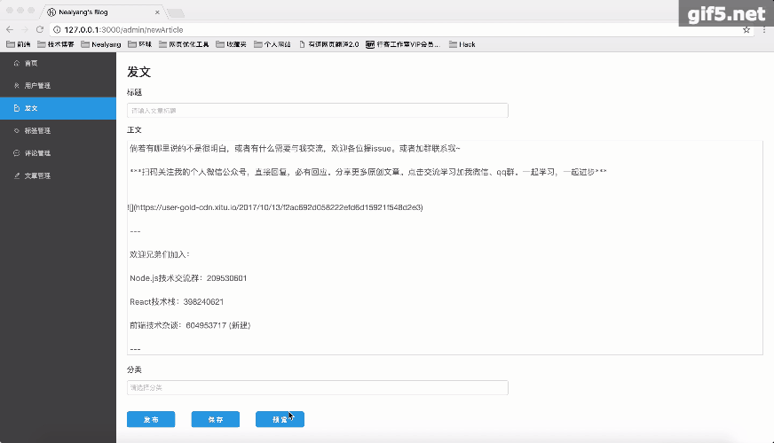
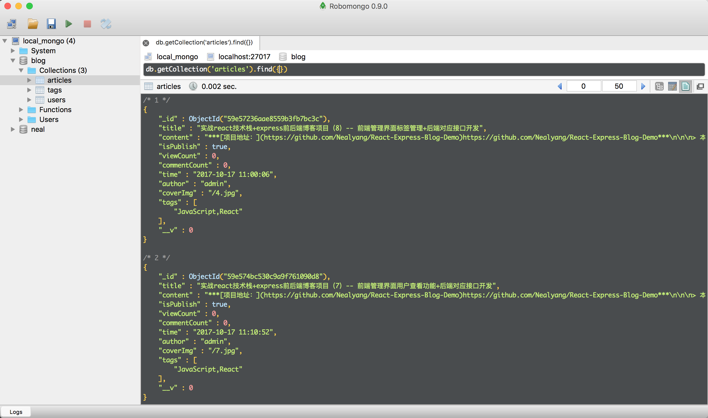

#  实战react技术栈+express前后端博客项目（9）-- 前端管理界面发表文章功能+后端对应接口

***[项目地址：](https://github.com/Nealyang/React-Express-Blog-Demo)https://github.com/Nealyang/React-Express-Blog-Demo***

> 本想等项目做完再连载一波系列博客，随着开发的进行，也是的确遇到了不少坑，请教了不少人。遂想，何不一边记录踩坑，一边分享收获呢。分享当然是好的，
如果能做到集思广益，那岂不是更美。我们的口号是：***坚决不会烂尾***

***本博客为连载代码博客同步更新博客，随着项目往后开发可能会遇到前面写的不合适的地方会再回头修改。如有不妥~欢迎兄弟们不啬赐教。谢谢！***

## 效果演示
- 效果展示

- 数据库截图

## 后端部分实现

文章内容初定包含如下字段：文章标题、文章内容、作者、文章标签、浏览数、评论数、发表时间、是否发布

所以定义schema如下：

	import mongoose from 'mongoose'

	module.exports = new mongoose.Schema({
	    title:String,//文章标题
	    content:String,//文章内容
	    viewCount:Number,//浏览次数
	    commentCount:Number,//评论次数
	    time:String,//发表时间
	    coverImg:String,//封面图片
	    author:String,//作者
	    tags:Array,//标签
	    isPublish:Boolean//是否发布
	});

后端发文接口开发其实就是一个存储文章的接口，初步接口设计为/api/admin/article/addArticle

	router.post('/addArticle', function (req, res) {
	    const {
	        title,
	        content,
	        time,
	        tags,
	        isPublish
	    } = req.body;
	    const author = req.session.userInfo.username;
	    const coverImg =  `/${Math.round(Math.random() * 9 + 1)}.jpg`;
	    const viewCount = 0;
	    const commentCount = 0;
	    let tempArticle = new Article({
	        title,
	        content,
	        isPublish,
	        viewCount,
	        commentCount,
	        time,
	        author,
	        coverImg,
	        tags
	    });
	    tempArticle.save().then(data=>{
	        responseClient(res,200,0,'保存成功',data)
	    }).cancel(err=>{
	        console.log(err);
	        responseClient(res);
	    });
	});

后端都比较常规。对于路由设计以及model大家可以自行查看源码

## 前端部分

界面编码：

	render() {
	        return (
	            

	                <h2>发文</h2>
	                

	                    标题
	                    <Input
	                        className={style.titleInput}
	                        placeholder={'请输入文章标题'}
	                        type='text'
	                        value={this.props.title}
	                        onChange={this.titleOnChange.bind(this)}/>
	                    正文
	                    <textarea
	                        className={style.textArea}
	                        value={this.props.content}
	                        onChange={this.onChanges.bind(this)}/>
	                    分类
	                    <Select
	                        mode="multiple"
	                        className={style.titleInput}
	                        placeholder="请选择分类"
	                        onChange={this.selectTags.bind(this)}
	                        defaultValue={this.props.tags}
	                    >
	                        {
	                            this.props.tagsBase.map((item) => {
	                                return (
	                                    <Option key={item}>{item}</Option>
	                                )
	                            })
	                        }
	                    </Select>

	                    

	                        <Button type="primary" onClick={this.publishArticle.bind(this)} className={style.buttonStyle}>发布</Button>
	                        <Button type="primary" onClick={this.saveArticle.bind(this)} className={style.buttonStyle}>保存</Button>
	                        <Button type="primary" onClick={this.preView.bind(this)} className={style.buttonStyle}>预览</Button>
	                    

	                

	                <Modal
	                    visible={this.state.modalVisible}
	                    title="文章预览"
	                    onOk={this.handleOk.bind(this)}
	                    width={'900px'}
	                    onCancel={this.handleOk.bind(this)}
	                    footer={null}
	                >
	                    

	                        

	                            {remark().use(reactRenderer).processSync(this.props.content).contents}
	                        

	                    

	                </Modal>
	            

	        )
	    }

由于定义为技术博客，所以这里我们只支持md语法。使用remark-react插件将md语法转换。textArea作为输入框。目前没有支持图片上传。如若想想支持图片上传功能，请查看我github上另一个demo。这里就不做演示了。

### 前端部分state设计

对于发文部分，我单独存储了title,tags,content。为了方便用户文章在写到一般的时候，切换别的菜单项。所以将他存储在state。在input中输入title,content,tags的时候，直接更新到state中。这样，在用户切换到别的tab再切换回来的时候，依旧可以看到自己之前输入的内容。

	const initialState={
	    title:'',
	    content:'',
	    tags:[]
	};
	export const actionTypes = {
	    UPDATING_TITLE:"UPDATING_TITLE",
	    UPDATING_CONTENT:"UPDATING_CONTENT",
	    UPDATING_TAGS:"UPDATING_TAGS",
	    SAVE_ARTICLE:"SAVE_ARTICLE"
	};
	export const actions = {
	    update_title:function (title) {
	        return{
	            type:actionTypes.UPDATING_TITLE,
	            title
	        }
	    },
	    update_content:function (content) {
	        return{
	            type:actionTypes.UPDATING_CONTENT,
	            content
	        }
	    },
	    update_tags:function (tags) {
	        return{
	            type:actionTypes.UPDATING_TAGS,
	            tags
	        }
	    },
	    save_article:function (data) {
	        return{
	            type:actionTypes.SAVE_ARTICLE,
	            data
	        }
	    }
	};

	export function reducer(state=initialState,action) {
	    switch (action.type){
	        case actionTypes.UPDATING_TITLE:
	            return{
	                ...state,title:action.title
	            };
	        case actionTypes.UPDATING_CONTENT:
	            return{
	                ...state,content:action.content
	            };
	        case actionTypes.UPDATING_TAGS:
	            return{
	                ...state,tags:action.tags
	            };
	        default:
	            return state;
	    }
	}

### 前端saga部分

saga中，我们需要判断用户是保存还是发布。所以我们加了isPublish字段来区分。当为发布的时候，一些必填字段需要我们去判断。

	export function* saveArticleFlow () {
	    while (true){
	        let request = yield take(NewArticleActionTypes.SAVE_ARTICLE);
	        console.log(request);
	        if(request.data.isPublish){
	            if(request.data.title === ''){
	                yield put({type: IndexActionTypes.SET_MESSAGE, msgContent: '请输入文章标题', msgType: 0});
	            }else if(request.data.content === ""){
	                yield put({type: IndexActionTypes.SET_MESSAGE, msgContent: '请输入文章内容', msgType: 0});
	            }else if(request.data.tags.length === 0){
	                yield put({type: IndexActionTypes.SET_MESSAGE, msgContent: '请选择文章分类', msgType: 0});
	            }
	        }
	        if((request.data.title&&request.data.content&&request.data.tags.length>0&&request.data.isPublish)|| (!request.data.isPublish)){
	            let res = yield call(saveArticle,request.data);
	            if(res){
	                if (res.code === 0) {
	                    yield put({type: IndexActionTypes.SET_MESSAGE, msgContent: res.message, msgType: 1});
	                    setTimeout(function () {
	                        location.replace('/admin/managerArticle');
	                    }, 1000);
	                } else if (res.message === '身份信息已过期，请重新登录') {
	                    yield put({type: IndexActionTypes.SET_MESSAGE, msgContent: res.message, msgType: 0});
	                    setTimeout(function () {
	                        location.replace('/');
	                    }, 1000);
	                } else {
	                    yield put({type: IndexActionTypes.SET_MESSAGE, msgContent: res.message, msgType: 0});
	                }
	            }
	        }
	    }
	}

当文章发表成功后，我们这里给定一秒后，跳转到文章管理界面，由于管理界面目前没有开发，所以现在跳转到管理界面后，是404.下一篇，我们将介绍文章管理部分的功能开发。

### 文章预览

文章的预览，直接使用antd的modal，然后转换md语法，展示效果。

## 结束语

总体来说，文章发布也是比较简单。一些细节，还希望大家多多琢磨。至此，一个博客网站的核心功能就完成了。

## 项目实现步骤系列博客
 
 - [x] [实战react技术栈+express前后端博客项目（0）-- 预热一波](./00_预热一波.md)
 - [x] [实战react技术栈+express前后端博客项目（1）-- 整体项目结构搭建、state状态树设计](./01_整体项目结构搭建、state状态树设计.md)
 - [x] [实战react技术栈+express前后端博客项目（2）-- 前端react-xxx、路由配置](./02_前端react-xxx、路由配置.md)
 - [x] [实战react技术栈+express前后端博客项目（3）-- 后端路由、代理以及静态资源托管等其他配置说明](./03_后端路由、代理以及静态资源托管等其他配置说明.md)
 - [x] [实战react技术栈+express前后端博客项目（4）-- 博客首页代码编写以及redux-saga组织](./04_博客首页代码编写以及redux-saga组织.md)
 - [x] [实战react技术栈+express前后端博客项目（5）-- 前后端实现登录功能](./05_前后端实现登录功能.md)
 - [x] [实战react技术栈+express前后端博客项目（6）-- 使用session实现免登陆+管理后台权限验证](./06_使用session实现免登陆+管理后台权限验证.md)
 - [x] [实战react技术栈+express前后端博客项目（7）-- 前端管理界面用户查看功能+后端对应接口开发](./07_前端管理界面用户查看功能+后端对应接口开发.md)
 - [x] [实战react技术栈+express前后端博客项目（8）-- 前端管理界面标签管理功能+后端对应接口开发](./08_前端管理界面标签管理功能+后端对应接口开发.md)
 - [x] [实战react技术栈+express前后端博客项目（9）-- 前端管理界面发表文章功能+后端对应接口开发](./09_前端管理界面发表文章功能+后端对应接口.md)
 - [ ] 实战react技术栈+express前后端博客项目（10）-- 前端管理界面评论管理功能+后端对应接口开发
 - [ ] 实战react技术栈+express前后端博客项目（11）-- 后端接口对应文章部分的增删改查
 - [ ] 实战react技术栈+express前后端博客项目（12）-- 前端对于发文部分的完善（增删改查、分页等）
 - [ ] 实战react技术栈+express前后端博客项目（13）-- 前端对于发文部分的完善（增删改查等）
 - [ ] 实战react技术栈+express前后端博客项目（14）-- 内容详情页以及阅读数的展示
 - [ ] 实战react技术栈+express前后端博客项目（15）-- 博客添加评论功能以及对应后端实现
 - [ ] 实战react技术栈+express前后端博客项目（16）-- pm2 的使用说明
 - [ ] 实战react技术栈+express前后端博客项目（17）-- 收工
 
 ## 交流
 
 倘若有哪里说的不是很明白，或者有什么需要与我交流，欢迎各位提issue。或者加群联系我~
 
 ***扫码关注我的个人微信公众号，直接回复，必有回应。分享更多原创文章。点击交流学习加我微信、qq群。一起学习，一起进步***
 
 
 
 ---
 
 欢迎兄弟们加入：
 
 Node.js技术交流群：209530601 
 
 React技术栈：398240621
 
 前端技术杂谈：604953717 (新建)
 
 ---
