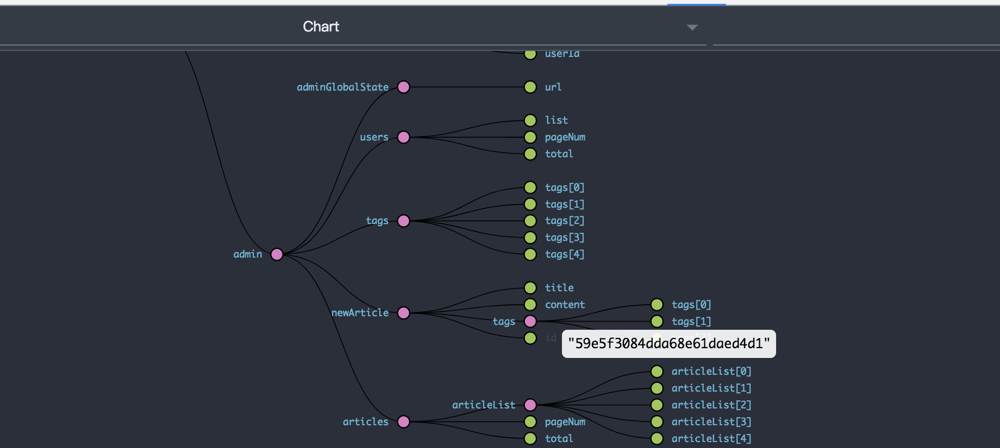

# 实战react技术栈+express前后端博客项目（10）-- 前端文章列表、路由控制以及对应后端文章管理开发

***[项目地址：](https://github.com/Nealyang/React-Express-Blog-Demo)https://github.com/Nealyang/React-Express-Blog-Demo***

> 项目目前基本已经开发完毕了，剩下的将博客继续补全

## 效果展示
- 查看文章


- 发表文章


- 修改文章


## 前端路由控制以及查看文章

```
export const ArticleListCell = (props)=>(
    <div className={`${style.container} `} onClick={()=>{props.history.push(`/detail/${props.data._id}`,{id:props.data._id});props.getArticleDetail(props.data._id)}}>
        <div>
            
        </div>
        <div className={style.bottomContainer}>
            <p className={style.title}>
                {props.data.title}
            </p>
            <p className={style.summary}>
                这里应该有摘要的，因为设计的数据库表表结构的时候忘记了，后面也是懒得加了，感觉太麻烦了，就算了
            </p>
            <div>
                <p>
                    <span>
                        
                        {props.data.time}
                    </span>
                    <span>
                        
                        {props.data.viewCount}
                    </span>
                    <span>
                        
                        {props.data.commentCount}
                    </span>
                </p>
                <span className={style.lastSpan}>
                    阅读全文 <span>》</span>
                </span>
            </div>
        </div>
    </div>
);
```

这是文章列表每一个cell的代码部分，其中主要的是click事件，然后push的路由地址。

对应redux-saga处理这部分请求

```javascript
export function* getArticleDetail (id) {
    yield put({type: IndexActionTypes.FETCH_START});
    try {
        return yield call(get, `/getArticleDetail?id=${id}`);
    } catch (err) {
        yield put({type: IndexActionTypes.SET_MESSAGE, msgContent: '网络请求错误', msgType: 0});
    } finally {
        yield put({type: IndexActionTypes.FETCH_END})
    }
}

export function* getArticleDetailFlow () {
    while (true){
        let req = yield take(FrontActionTypes.GET_ARTICLE_DETAIL);
        let res = yield call(getArticleDetail,req.id);
        if(res){
            if(res.code === 0){
                yield put({type: FrontActionTypes.RESPONSE_ARTICLE_DETAIL,data:res.data});
            }else{
                yield put({type: IndexActionTypes.SET_MESSAGE, msgContent: res.message, msgType: 0});
            }
        }
    }
}
```
其实操作很简单，就是点击列表的item后，路由为detail/article_id的形式。然后进入页面根据当前路由的id，然后从接口获取相关数据，然后渲染页面。由于这是一个技术博客，所以我们数据库存储的是一个md语法的字符串，具体detail页面的前端编码如下：

```javascript
render(){
        const {articleContent,title,author,viewCount,commentCount,time} = this.props;
        return(
            <div className={style.container}>
                <h2>{title}</h2>
                <div className={style.articleInfo}>
                    <span >
                         {author}
                    </span>
                    <span>
                         {time}
                    </span>
                    <span>
                         {commentCount}
                    </span>
                    <span>
                         {viewCount}
                    </span>
                </div>
                <div id='preview' className={style.content}>
                    {remark().use(reactRenderer).processSync(articleContent).contents}
                </div>
            </div>
        )
    }
```

使用第三方插件remark-react以及remark，完成Markdown语法的转换。

## 后端部分

由于获取文章详情，是所有人都应该具有的权限，所以这里我们不应该放到admin 后面进行权限查看

```nodemon
//获取文章详情
router.get('/getArticleDetail', (req, res) => {
    let _id = req.query.id;
   Article.findOne({_id})
       .then(data=>{
           data.viewCount = data.viewCount+1;
           Article.update({_id},{viewCount:data.viewCount})
               .then(result=>{
                   responseClient(res,200,0,'success',data);
               }).cancel(err=>{
                   throw err;
           })

       }).cancel(err => {
       responseClient(res);
   });
});
```

对于文章的crud这里主要如下：

```nodemon
const router = Express.Router();
import Article from '../../models/article'
import {responseClient} from '../util'

router.post('/addArticle', function (req, res) {
    const {
        title,
        content,
        time,
        tags,
        isPublish
    } = req.body;
    const author = req.session.userInfo.username;
    const coverImg =  `/${Math.round(Math.random() * 9 + 1)}.jpg`;
    const viewCount = 0;
    const commentCount = 0;
    let tempArticle = new Article({
        title,
        content,
        isPublish,
        viewCount,
        commentCount,
        time,
        author,
        coverImg,
        tags:tags.split(',')
    });
    tempArticle.save().then(data=>{
        responseClient(res,200,0,'保存成功',data)
    }).cancel(err=>{
        console.log(err);
        responseClient(res);
    });
});

router.post('/updateArticle',(req,res)=>{
    const {
        title,
        content,
        time,
        tags,
        isPublish,
        id
    } = req.body;
    Article.update({_id:id},{title,content,time,tags:tags.split(','),isPublish})
        .then(result=>{
            console.log(result);
            responseClient(res,200,0,'更新成功',result)
        }).cancel(err=>{
        console.log(err);
        responseClient(res);
    });
});

router.get('/delArticle',(req,res)=>{
    let id = req.query.id;
    Article.remove({_id:id})
        .then(result=>{
            if(result.result.n === 1){
                responseClient(res,200,0,'删除成功!')
            }else{
                responseClient(res,200,1,'文章不存在');
            }
        }).cancel(err=>{
            responseClient(res);
    })
});
```

代码在article.js当中。

操作都是比较中规中矩的，因为就是数据的增删改查。

## admin前端界面的编码部分

```javascript
render(){
        return(
            <div>
                <h2>文章管理</h2>
                <div className={style.articleListContainer}>
                    {
                        this.props.articleList.map((item,index)=>(
                            <ManagerArticleCell
                                edit_article={(id)=>this.props.edit_article(id)}
                                history={this.props.history}
                                getArticleDetail={(id)=>this.props.get_article_detail(id)}
                                delete={(id)=>this.props.delete_article(id)}
                                key={index} data={item}/>
                        ))
                    }
                </div>
                <div  className={style.paginationStyle}>
                    <Pagination
                        defaultPageSize={5}
                        onChange={(pageNum)=>{
                            this.props.get_article_list(pageNum);
                        }}
                        current={this.props.pageNum}
                        total={this.props.total}
                    />
                </div>
            </div>
        )
    }
```

文章的删除非常的简单，就是去调用接口，走到这个阶段我想这里应该不是难事，这里我们需要重点关注的应该是文章的修改部分。

文章的修改在使用方面看来是直接跳转到发文部分的页面，然后修改后该文章对应修改。所以对于开发就得知道在新建文章页面的部分到底点击保存时修改还是新建。我们可以做到，就是因为我们判断到newArticle页面是否具有id

下面是该状态树：



所以至此，其实我们对于发文也就没有什么难点了。

## 交流

---

欢迎兄弟们加入：

Node.js技术交流群：209530601 

React技术栈：398240621

前端技术杂谈：604953717 (新建)

---