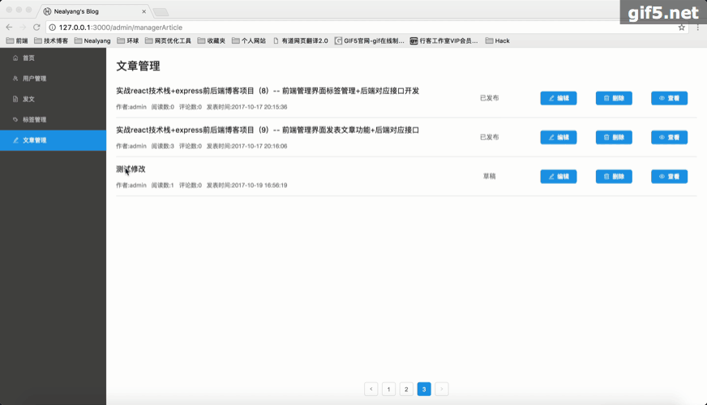
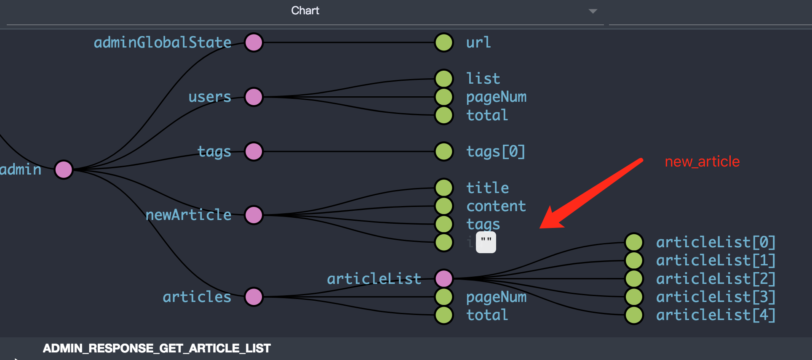
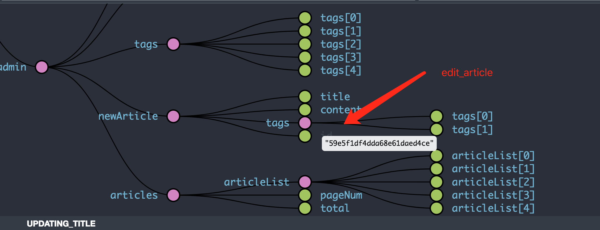

# 实战react技术栈+express前后端博客项目（11）-- 前端文章管理部分完善

***[项目地址：](https://github.com/Nealyang/React-Express-Blog-Demo)https://github.com/Nealyang/React-Express-Blog-Demo***

> 项目目前基本已经开发完毕了，剩下的将博客继续补全

## 效果展示
- 查看文章

- 发表文章

- 修改文章

## 介绍
对于文章管理这部分，其实稍微还是比较复杂的，毕竟这也是一个网站的核心部分。这里记录下开发的思路。

对于发文，没有什么可以注意的，就是直接写文章，然后保存、预览和发布三个功能按钮，对于预览，也就是给一个弹出层，然后预览文章的基本样式，对于保存，顾名思义也就是说，该文章并没有发布，为草稿阶段，然后发布，也就是直接发布出去。发布和保存成功后，直接跳转到文章管理界面。对于文章管理界面中，删除当然，很简单，预览就是直接跳转到文章详情页预览，修改，也就是跳转到文章发布的界面，然后在redux中记录当前文章的id，在保存的时候，检查id，判断是否为修改还是新建。大体思路如下，下面我们看下具体代码吧。

## 前端数据处理部分

    const initialState = {
        articleList: [],
        pageNum: 1,
        total: 0
    };
    
    export const actionTypes = {
        ADMIN_GET_ARTICLE_LIST: 'ADMIN_GET_ARTICLE_LIST',
        ADMIN_RESPONSE_GET_ARTICLE_LIST: "ADMIN_RESPONSE_GET_ARTICLE_LIST",
        ADMIN_EDIT_ARTICLE: "ADMIN_EDIT_ARTICLE",
        ADMIN_DELETE_ARTICLE: "ADMIN_DELETE_ARTICLE",
    };
    
    export const actions = {
        get_article_list: function (pageNum = 1) {
            return {
                type: actionTypes.ADMIN_GET_ARTICLE_LIST,
                pageNum
            }
        },
        delete_article: function (id) {
            return {
                type: actionTypes.ADMIN_DELETE_ARTICLE,
                id
            }
        },
        edit_article: function (id) {
            return {
                type: actionTypes.ADMIN_EDIT_ARTICLE,
                id
            }
        }
    };
    
    export function articles(state = initialState, action) {
        switch (action.type) {
            case actionTypes.ADMIN_RESPONSE_GET_ARTICLE_LIST:
                return {
                    ...state, articleList: [...action.data.list], total: action.data.total,pageNum:action.data.pageNum
                };
            default:
                return state;
        }
    }
    
 文章管理部分的state、action以及redux定义。
 
 然后这里我们举例edit的saga处理如下：
 
     export function* editArticle (id) {
         yield put({type: IndexActionTypes.FETCH_START});
         try {
             return yield call(get, `/getArticleDetail?id=${id}`);
         } catch (err) {
             yield put({type: IndexActionTypes.SET_MESSAGE, msgContent: '网络请求错误', msgType: 0});
         } finally {
             yield put({type: IndexActionTypes.FETCH_END})
         }
     }
     
     export function* editArticleFlow () {
         while (true){
             let req = yield take(ArticleTypes.ADMIN_EDIT_ARTICLE);
             let res = yield call(editArticle,req.id);
             if(res){
                 if (res.code === 0) {
                     let title = res.data.title;
                     let content = res.data.content;
                     let tags = res.data.tags;
                     let id = res.data._id;
                     yield put({type:NewArticleTypes.SET_ARTICLE_ID,id});
                     yield put({type:NewArticleTypes.UPDATING_TAGS,tags});
                     yield put({type:NewArticleTypes.UPDATING_CONTENT,content});
                     yield put({type:NewArticleTypes.UPDATING_TITLE,title});
                 } else {
                     yield put({type: IndexActionTypes.SET_MESSAGE, msgContent: res.message, msgType: 0});
                 }
             }
         }
     }
     
 如下是redux 状态树的对比图
 
 
 
 
 
 ## 后端对文章API部分的处理
 
 后端的处理，这里就是简单的CRUD，注意获取文章详情是部分权限的，别的也就没有什么特殊的操作了。这里不再做过多介绍。
 
 

## 交流

---

欢迎兄弟们加入：

Node.js技术交流群：209530601 

React技术栈：398240621

前端技术杂谈：604953717 (新建)

--- 
 